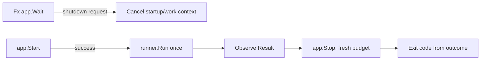

# jobfx

[](https://pkg.go.dev/github.com/uchaloop/jobfx) [](https://github.com/uchaloop/jobfx/actions/workflows/ci.yml) [](https://github.com/uchaloop/jobfx/tags) [](LICENSE)

[Install](#installation) · [Quick start](#quick-start) · [Lifecycle](#run-the-process) · [Configuration](#recommended-configuration) · [Examples](#documentation)

Optional Uber Fx integration for [job](https://github.com/uchaloop/job).
This is an independent Go module; importing job alone does not require Fx.

## Installation

Requires Go 1.27 or later.

```sh
go get github.com/uchaloop/jobfx@v0.1.0
```

## Quick start

```go
var runner *job.Runner
app := fx.New(
    fx.Supply(job.Config{Timeout: 4 * time.Minute}),
    fx.Provide(func() job.Func {
        return func(ctx context.Context) (int64, error) {
            // Replace with one batch of application work.
            return 0, ctx.Err()
        }
    }),
    jobfx.Module(),
    fx.Populate(&runner),
)
```

Import `github.com/uchaloop/job`, `github.com/uchaloop/jobfx` and
`go.uber.org/fx`. Provide application dependencies through additional Fx constructors.
`Module` provides a Runner; it never executes work or registers a work OnStart
hook. Optional `jobfx.Options` is one ordered slice of job options: static
Module options first, then container options. Middleware accumulates in this
order, with the first wrapper outermost.

## Run the process



> [!IMPORTANT]
> `Module()` provides a Runner. Work starts only when the application calls Run
> after successful startup; it does not run inside OnStart.


The [executable example](example_test.go) shows the full lifecycle, including
an optional cluster decision before opening dependencies:

1. Subscribe to `app.Wait()` before `app.Start` and bridge shutdown to the
   startup/work context. Fx is the only signal receiver.
2. Start dependencies with a startup deadline. Do not run work after failure.
3. Call `runner.Run(workCtx)` once, after every startup hook succeeds.
4. Observe the Result with an independent, bounded context.
5. Call `app.Stop` with a fresh cleanup budget after the work actually returns.
6. Return a nonzero exit code for startup failure or a non-ok attempt.
   The example logs cleanup errors without retrying successful business work.

Ordinary completion calls Stop directly, without asking Shutdowner to report
successful work as a termination signal. A noncooperative job can still prevent
cleanup: cancellation cannot interrupt Go code. Keep the shutdown subscription
alive until observation and cleanup finish.

## Documentation

[API reference on pkg.go.dev](https://pkg.go.dev/github.com/uchaloop/jobfx)

## Recommended configuration

> [!TIP]
> We recommend [confmaker](https://github.com/uchaloop/confmaker) for typed ENV
> configuration and [confx](https://github.com/uchaloop/confx) for its Fx integration.
> Configuration loading stays in the application; it is optional for the work libraries.

<details>
<summary><strong>Configure from ENV with confmaker / confx</strong></summary>

Replace `fx.Supply(job.Config{...})` in the quick start with these Fx options:

```go
confx.Module(),
confx.Provide[job.Config](),
```

Import `github.com/uchaloop/confx`. Include `confx.Module()` once, even when
registering several config types. Keep the work constructor and adapter Module.

`JOB_TIMEOUT=4m` fills job.Config.

</details>

## Related libraries

| Library | Purpose |
|---|---|
| [job](https://github.com/uchaloop/job) | Execution contract |
| [beatfx](https://github.com/uchaloop/beatfx) | Run recurring work in an Fx daemon |

## Acknowledgements

Thanks to the authors and maintainers of [Uber Fx](https://github.com/uber-go/fx)
for dependency injection and lifecycle primitives that make this adapter possible.

## License

[MIT](LICENSE)
